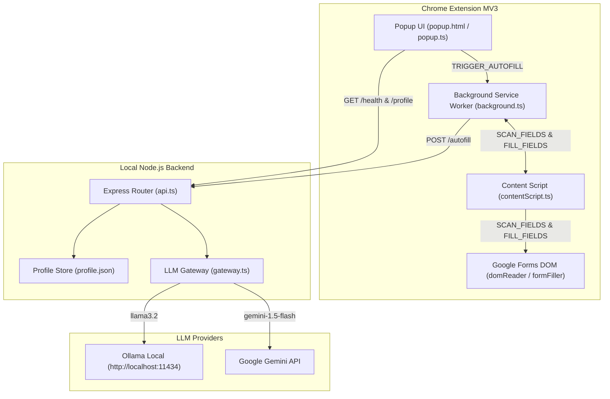

# AutoFiller — AI-Powered Google Forms Auto-Filler

> Automatically match and fill Google Forms text inputs using local AI (Ollama) or cloud AI (Google Gemini).

AutoFiller is a production-ready Chrome Extension (Manifest V3) backed by a local Node.js + Express server. It intelligently extracts form field metadata from Google Forms DOM, maps fields against your local user profile using LLMs, and injects accurate values with native event dispatching for Google Forms validation.

---

## Key Features

- **Google Forms Support**: Dedicated DOM reader & native event dispatching (`input`, `change`, `blur`) for text inputs & textareas.
- **Dual LLM Gateway**:
  - **Ollama (Local & Free)**: Default local LLM matching using `llama3.2` via `http://localhost:11434`.
  - **Google Gemini (Cloud)**: High-performance cloud LLM matching via Gemini 1.5 Flash API.
- **Dark Mode Glassmorphism UI**: Sleek Chrome Extension popup UI with live backend health indicator, active profile quick preview card, and instant settings auto-save.
- **Visual Feedback**: Subtle 2-second green glow animation on auto-filled DOM fields.
- **Local Test Form Fixture**: Built-in test endpoint (`http://localhost:3456/test-form`) for instant manual QA and integration testing.

---

## Architecture Diagram



---

## Prerequisites

- **Node.js**: v18.0.0 or higher
- **npm**: v9.0.0 or higher
- **Google Chrome**: v120 or higher
- **Ollama** (Recommended for local AI): Installed and running locally (`http://localhost:11434`). Download from [ollama.com](https://ollama.com).

---

## Quick Start Guide

### 1. Installation

```bash
# Clone repository
git clone https://github.com/01MASTERS/AutoFiller.git
cd AutoFiller

# Install all workspace dependencies
npm install
```

### 2. Configure Profile Data

Edit `backend/profile.json` to define your auto-fill profile details:

```json
{
  "name": "Jane Doe",
  "email": "jane@example.com",
  "phone": "+1-555-0199",
  "address": "123 Tech Lane, San Francisco, CA"
}
```

### 3. Start Backend & Extension

**Option A (Windows 1-Click Startup Script):**
Double-click `start.bat` or run:
```cmd
.\start.bat
```
*This automatically installs dependencies, creates missing `.env` & `profile.json` templates, compiles shared types, starts the server and extension watcher, and opens the Debug Log Dashboard.*

**Option B (Manual npm command):**
```bash
# Start backend server + extension compiler in watch mode
npm run dev
```

The local backend will run at `http://localhost:3456`.

### 4. Setup Ollama (Local LLM)

```bash
# Pull and start the recommended lightweight Ollama model
ollama run llama3.2
```

### 5. Build and Load Extension in Chrome

> If you started AutoFiller using `start.bat`, `extension/dist` is already built for you.
> If running manually, build the extension first so `extension/dist/manifest.json` is generated:
> ```bash
> npm run build -w extension
> ```

1. Open Chrome and navigate to `chrome://extensions`.
2. Enable **Developer mode** (toggle switch in the top right).
3. Click **Load unpacked**.
4. Select the `extension/dist` folder in this repository.

---

## End-to-End Testing with Test Form

Open `http://localhost:3456/test-form` in Chrome to test AutoFiller against a realistic Google Form DOM fixture:

1. Click the **AutoFiller** extension icon in Chrome toolbar.
2. Ensure the status pill shows **Online**.
3. Click **Auto-Fill Form**.
4. Observe the green highlight glow as form fields are populated with your profile details!

---

## API Endpoints

The backend server exposes the following REST API endpoints at `http://localhost:3456`:

| Endpoint | Method | Description |
|---|---|---|
| `/health` | `GET` | Server health check (returns `{ status: "ok" }`) |
| `/profile` | `GET` | Returns stored user profile object |
| `/autofill` | `POST` | Maps extracted form fields to profile values using LLM Gateway |
| `/test-form` | `GET` | Serves realistic Google Form QA HTML fixture page |

---

## Development Commands

```bash
# Run tests across backend and extension workspaces
npm run test

# Run ESLint across all TypeScript source files
npm run lint

# Build production bundles
npm run build
```

---

## Troubleshooting & Edge Cases

- **Edge Cases & Limitations Guide**: See [EDGE_CASES.md](./EDGE_CASES.md) for an in-depth catalog of form quirks, DOM edge cases, and the step-by-step debugging playbook.
- **Backend Offline in Popup**: Ensure backend server is running on port 3456 (`npm run dev -w backend` or `start.bat`).
- **Ollama Error**: Ensure Ollama is installed and running (`ollama run llama3.2`).
- **Gemini Error**: Verify your Gemini API key in the extension popup settings.
- **Debug Logs**: Open `http://localhost:3456/logs-ui` or click "Open Debug Logs" in the popup to inspect live scan, LLM mapping, and DOM filling logs.

---

## License

MIT
