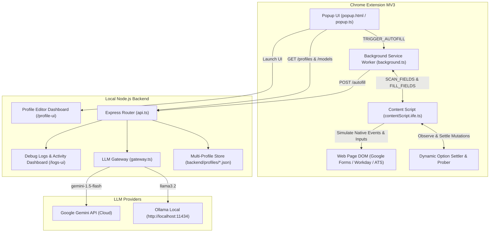

# AutoFiller — Universal AI-Powered Form Auto-Filler

> Automatically scan, match, and fill job applications, career portals, and forms using local AI (Ollama) or cloud AI (Google Gemini).

AutoFiller is a production-ready Chrome Extension (Manifest V3) backed by a local Node.js + Express backend. It universally inspects form fields across **Google Forms**, **Workday**, **Greenhouse**, **Lever**, and standard **HTML5 career portals**, matches them against your multi-persona profile data via LLMs, and injects accurate values with native event simulation, mutation-aware dynamic option handling, and instant visual feedback.

---

## Key Features

- **Universal Multi-Platform Support**:
  - **Google Forms**: Role-based containers, tick options, checkbox grids, and custom listboxes.
  - **Workday**: Dynamic search comboboxes, prompt buttons, hierarchical drill-downs (e.g. "How did you hear about us?"), country phone code pickers, and multi-step application flows.
  - **Greenhouse & Lever**: Native and customized applicant tracking system (ATS) controls, multi-frame iframe discovery (`all_frames: true`), and file upload link matching.
  - **Generic Career Portals**: Universal HTML5 form inputs, textareas, native `<select>`, and ARIA listboxes.
- **Dynamic Backend Options & Cascading Selects (Phase 24)**:
  - Smart heuristic classifier differentiates static options from async backend-fetched options.
  - Mutation settlement engine awaits live option arrival via `MutationObserver` on lazy-loaded dropdowns.
  - Dependency-aware topological filling resolves upstream triggers before child dropdowns (e.g., Country → State/Region).
- **Multi-Profile Persona Management (v1.2)**:
  - Create and maintain tailored personas (e.g., *Frontend Engineer*, *Full Stack Developer*, *Consultant*) in `backend/profiles/*.json`.
  - Instant profile switching right from the extension popup with offline caching.
  - Dedicated **Web-based Profile Editor Dashboard** (`http://localhost:3456/profile-ui`) featuring visual forms (skills chips, work experience, custom Q&A) and raw JSON editor with syntax validation.
- **Dual LLM Gateway**:
  - **Ollama (Local & 100% Private)**: Zero-cost, privacy-first local matching using `llama3.2` (or any installed model) via `http://localhost:11434`.
  - **Google Gemini (Cloud Fallback)**: High-performance cloud LLM matching via Gemini 1.5 Flash API.
- **Sleek Extension Popup**:
  - Dark mode glassmorphism UI with live backend health pill, active profile switcher, model selector, auto-dismissing toast alerts, and direct debug launchers.
  - Visual 2-second glow animation on populated fields in active tabs.
- **Silent Background Service & Windows Startup**:
  - Run completely headless in the background without persistent console windows.
  - One-click Windows startup integration (`npm run startup:install`).
- **Interactive Multi-Platform QA Hub**:
  - Built-in test fixtures served directly from `http://localhost:3456/test-forms` (Greenhouse, Lever, Workday, Career, Google Forms, and Dynamic Options).
- **Activity & Debug Logging**:
  - Real-time web dashboard at `http://localhost:3456/logs-ui` with collapsible inspection for field scanning, LLM prompt generation, and DOM filling diagnostics.

---

## Architecture Diagram


```mermaid
graph TD
  subgraph Extension["Chrome Extension MV3"]
    UI["Popup UI (popup.html / popup.ts)"]
    SW["Background Service Worker (background.ts)"]
    CS["Content Script (contentScript.iife.ts)"]
    DOM["Web Page DOM (Google Forms / Workday / ATS)"]
    DYN["Dynamic Option Settler & Prober"]
  end

  subgraph Backend["Local Node.js Backend"]
    API["Express Router (api.ts)"]
    STORE["Multi-Profile Store (backend/profiles/*.json)"]
    PUI["Profile Editor Dashboard (/profile-ui)"]
    LOGS["Debug Logs & Activity Dashboard (/logs-ui)"]
    GW["LLM Gateway (gateway.ts)"]
  end

  subgraph LLMs["LLM Providers"]
    OL["Ollama Local (http://localhost:11434)"]
    GM["Google Gemini API (Cloud)"]
  end

  UI -->|TRIGGER_AUTOFILL| SW
  UI -->|GET /profiles & /models| API
  UI -->|Launch UI| PUI
  SW <-->|SCAN_FIELDS & FILL_FIELDS| CS
  CS <-->|Observe & Settle Mutations| DYN
  CS -->|Simulate Native Events & Inputs| DOM
  SW -->|POST /autofill| API
  API --> STORE
  API --> GW
  GW -->|llama3.2| OL
  GW -->|gemini-1.5-flash| GM
  API --> LOGS
```

---

## Prerequisites

- **Node.js**: v18.0.0 or higher
- **npm**: v9.0.0 or higher
- **Google Chrome**: v120 or higher
- **Ollama** (Recommended for local AI): Installed and running locally (`http://localhost:11434`). Download from [ollama.com](https://ollama.com).

---

## Quick Start Guide

### 1. Installation

```bash
# Clone repository
git clone https://github.com/01MASTERS/AutoFiller.git
cd AutoFiller

# Install all workspace dependencies
npm install
```

### 2. Configure Your Profile Data

You can configure your persona profiles in either of two ways:

- **Via Web Dashboard (Recommended)**: Open `http://localhost:3456/profile-ui` while the backend is running to edit personas visually with instant validation.
- **Via JSON File**: Edit `backend/profiles/default.json` (or create new persona files in `backend/profiles/`):

```json
{
  "name": "Jane Doe",
  "email": "jane@example.com",
  "phone": "+1-555-0199",
  "address": "123 Tech Lane, San Francisco, CA",
  "education": [
    {
      "institution": "University of Technology",
      "degree": "B.S. in Computer Science",
      "graduationYear": "2024"
    }
  ],
  "skills": ["TypeScript", "React", "Node.js", "Python"],
  "links": {
    "LinkedIn": "https://linkedin.com/in/janedoe",
    "GitHub": "https://github.com/janedoe"
  }
}
```

### 3. Start Backend & Extension

#### Option A: Windows 1-Click Startup Script
Double-click `start.bat` or run:
```cmd
.\start.bat
```
*This automatically installs dependencies, creates missing `.env` & profile templates, builds shared packages, starts the server and extension watcher, and opens the Debug Log Dashboard.*

#### Option B: Manual npm Command
```bash
# Start backend server + extension compiler in watch mode
npm run dev
```

#### Option C: Silent Background & Windows Startup
AutoFiller can run silently in the background with zero pop-up console windows, logging directly to `autofiller.log`:
- **Run at Windows Startup**: Double-click `install-startup.bat` (or run `npm run startup:install`). AutoFiller will launch silently on every Windows login.
- **Start in Background Now**: Double-click `start-background.vbs` (or run `npm run start:background`).
- **Check Status**: Double-click `status.bat` (or run `npm run status`) to view server port status, PID, and live log tail.
- **Stop Background Service**: Double-click `stop.bat` (or run `npm run stop`) to terminate background processes and free port 3456.
- **Remove from Startup**: Double-click `uninstall-startup.bat` (or run `npm run startup:uninstall`).

The local backend runs at `http://localhost:3456`.

### 4. Setup Ollama (Local LLM)

```bash
# Pull and start the recommended lightweight Ollama model
ollama run llama3.2
```

### 5. Build and Load Extension in Chrome

> If you started AutoFiller using `start.bat` or `npm run dev`, `extension/dist` is already built for you.
> To build manually for production:
> ```bash
> npm run build
> ```

1. Open Chrome and navigate to `chrome://extensions`.
2. Enable **Developer mode** (toggle switch in the top right).
3. Click **Load unpacked**.
4. Select the `extension/dist` folder in this repository.

---

## Testing & Verification with QA Hub

AutoFiller includes interactive QA test fixtures representing all supported platforms:

1. Open the QA Hub in Chrome: `http://localhost:3456/test-forms`
2. Select any platform fixture:
   - **Google Forms**: `/test-forms/google-forms` (or `/test-form`)
   - **Greenhouse ATS**: `/test-forms/greenhouse`
   - **Lever ATS**: `/test-forms/lever`
   - **Workday Portal**: `/test-forms/workday`
   - **Generic Career Application**: `/test-forms/career`
   - **Dynamic & Cascading Options**: `/test-forms/dynamic-options`
3. Click the **AutoFiller** extension icon in your Chrome toolbar.
4. Select your desired Persona profile and LLM provider.
5. Click **Auto-Fill Form**.
6. Watch fields populate with green visual highlight feedback and instant dynamic settlement!

---

## API Endpoints

The backend server exposes the following REST API endpoints at `http://localhost:3456`:

| Endpoint | Method | Description |
|---|---|---|
| `/health` | `GET` | Server health check (`{ status: "ok", timestamp: "..." }`) |
| `/profiles` | `GET` | Returns list of all available persona profiles |
| `/profiles/:id` | `GET`, `PUT`, `DELETE` | Read, update, or delete a specific persona profile |
| `/profiles/switch` | `POST` | Switch active persona profile |
| `/profile` | `GET`, `PUT` | Read or update the currently active profile (legacy compatible) |
| `/profile-ui` | `GET` | Interactive visual profile editor dashboard (alias `/profiles-ui`) |
| `/models` | `GET` | Returns list of available local Ollama models |
| `/autofill` | `POST` | Maps extracted form fields to profile values using LLM Gateway |
| `/logs` | `GET`, `POST`, `DELETE` | Query, ingest, or clear system activity and debug logs |
| `/logs-ui` | `GET` | Real-time Activity & Debug Logs web dashboard |
| `/test-forms` | `GET` | Interactive Multi-Platform QA fixtures directory |
| `/test-forms/:platform` | `GET` | Individual mock form fixtures (`greenhouse`, `lever`, `workday`, `career`, `dynamic-options`, `google-forms`) |

---

## Development Commands

```bash
# Run tests across all workspaces (extension, backend, shared)
npm run test

# Run ESLint across all TypeScript source files
npm run lint

# Build production bundles (shared, extension, backend)
npm run build

# Format code with Prettier
npm run format
```

---

## Troubleshooting & Edge Cases

- **Edge Cases & Limitations Guide**: See [EDGE_CASES.md](./EDGE_CASES.md) for an in-depth catalog of form quirks, DOM edge cases, and the step-by-step debugging playbook.
- **Backend Offline in Popup**: Ensure backend server is running on port 3456 (`npm run dev` or `start.bat` or `npm run start:background`).
- **Ollama Error**: Ensure Ollama is running (`ollama run llama3.2`).
- **Gemini Error**: Verify your Gemini API key in the extension popup settings.
- **Debug Logs**: Open `http://localhost:3456/logs-ui` or click **Open Logs** in the extension popup to inspect live scan, LLM mappings, and DOM filling diagnostics.

---

## License

MIT
